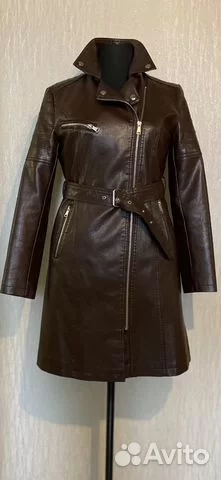
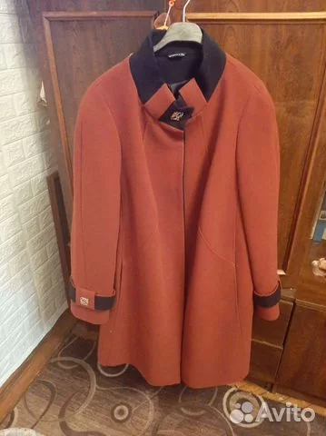

## 1) Оценить потенциал проекта. Насколько важно решить задачу?

Проблема: пользователи выкладывают фотографии товаров и не всегда задумываются о фоне. Плохо подобранный фон может снизить привлекательность фотографий и повлиять на финальное решение о покупке.

Ниже приведен пример фотографии пальто на хорошем и плохом фоне, первое фото выглядит намного привлекательнее.
 

Задачу важно решить, так как товары изначально сфотографированные на подходящем фоне будут продаваться значительно быстрее.

Существует отдельный [сервис](https://removal.ai/), позволяющий убирать фон с изображений товаров для торговых площадок. В этой [статье](https://removal.ai/plain-white-background-images/) подробно описано почему фон в объявлениях важен.

## 2) Есть ли простое решение? Насколько оно решит задачу? Сложно ли поддерживать такое решение?

Если совсем без МЛ, то, возможно, можно придумать, как ненавязчиво включить информацию о том, что такое ‘хороший фон’ в раздел создания карточки товара. Тогда больше людей будет делать хорошие фото.

Другой вариант - это сделать первый прототип решения, основанный на методах классического компьютерного зрения. Но, как правило, такие методы сильно проигрывают нейросетевым и ведут себя нестабильно при изменяющихся условиях съемки (разрешение, освещение, ракурс и тд).

Также, можно остановиться на задаче бинарной классификации хороший фон или нет, и просто оповещать пользователя, если мы считаем его фон неудачным. Возможно, он перефотографирует свой товар.

## 3) Реалистичность решения проблемы с помощью машинного обучения.

Для перенесения товара на более подходящий фон необходимо вырезать его с фотографии - это задача сегментации, которая давно и довольно успешно решается с помощью нейросетей, есть открытые датасеты (PASCAL VOC, MS COCO) и соревнования (CARVANA) по этой тематике.

Прежде чем переносить вырезать объект, нужно определить, находится ли он на неподходящем фоне - это задача бинарной классификации, которую также успешно решают нейросети.

В первом пункте был упомянут отдельный сервис, решающий очень похожую задачу, а если задача уже была решена кем-то другим, скорее всего будет несложно найти статьи, библиотеки, датасеты и тд для решения этой задачи.
