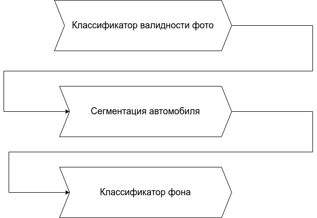

## 1) Решение с примером использования.

В качестве решения проблемы необходимо разработать сервис, который вырезает автомобиль с изображения и переносит на более подходящий фон.

Пользователь загружает фотографию авто, затем сервис предлагает ему несколько вариантов фона, наиболее подходящих к данной фотографии

Общий пайплайн:
1. Модель, определяющая есть ли автомобиль на фото - бинарный классификатор. Если есть, перейти  к следующему этапу, иначе попросить загрузить другое фото
2. Модель, вырезающая автомобиль - нейросеть для семантической сегментации
3. Модель, которая определяет какой фон лучше подойдет для данной фотографии - задача многоклассовой классификации. (Можно изначально подобрать несколько вариантов фона - это и будут классы)

## 2) Какая бизнес-метрика должна оптимизироваться? Какое её значение будет считаться успехом?

???
Классификатор на первом этапе должен определять как можно больше невалидных фото. При этом нельзя, чтобы отклонялось много валидных фотографий. Предлагается зафиксировать абсолютное количество ложных срабатываний < 5(?) в сутки и при этом максимизировать долю найденных невалидных фото.   (или < 0.5 на пользователя в среднем при условии <=1 max или >0.95 accuracy на пользователя в среднем но не менее 0.9)
???

Также нельзя допускать, чтобы обрезались части автомобиля, это может снизить привлекательность объявления гораздо сильнее, чем неудачный фон, поэтому в первую очередь нужно сосредоточиться на максимальном качестве сегментации. Пусть не меньше 90% автомобиля с исходной фотографии должно попадать на новый фон.

## 3) Какая метрика машинного обучения будет наилучшим образом отражать оптимизацию бизнес-метрики?

Мы можем использовать автоматический подбор порога, исходя из требований по точности, и стремиться к максимальной полноте.
В качестве метрики сегментации можно взять IoU и стремится достичь его значения не менее 0.9
