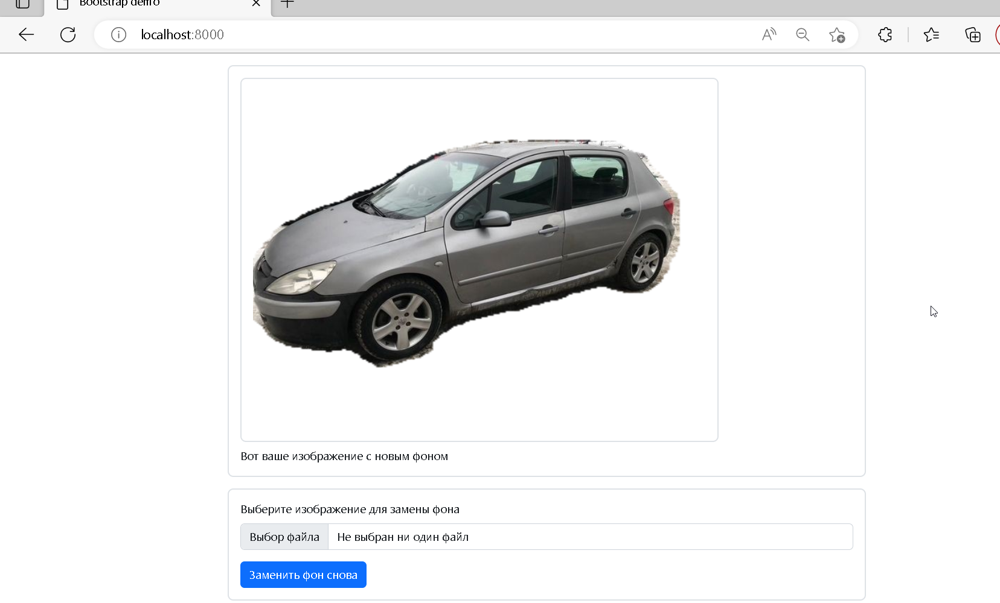
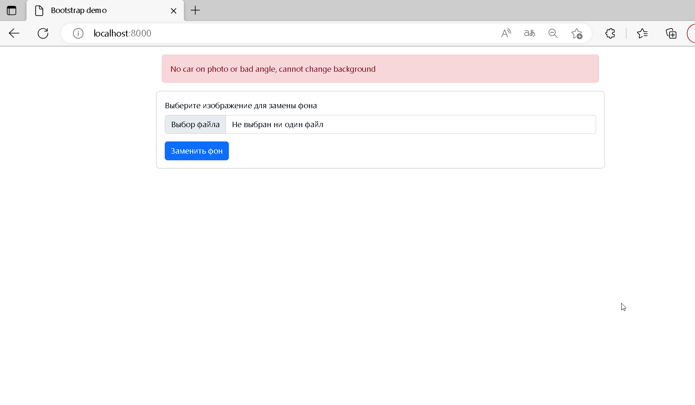

# AAA ML Project  

## Описание  

В этом репозитории находится приложение, созданное студентами ААА в качестве учебного проекта.

Приложение позволяет заменить фон на фотографии автомобиля.  
**Работает только с .jpg файлами!**
  
Проект выполнила команда «Бандитский Петербург»  

Состав команды
========

Владимир Кравцов (капитан)

Владислав Колесов

Алексей Аносов

Установка
=========

Для сборки докер образа::

`$ make build`

Запуск
======

Для запуска в режиме разработки с автоматической перезагрузкой сервера при
изменении кода::

`$ make dev`

Для запуска приложения напрямую::

`$ make run`

Для запуска тестов::

`python -m pytest tests/`

Для выполнения линтеров::

`$ make lint`

или каждый по отдельности::

`$ make flake8`
`$ make pycodestyle`
`$ make pylint`

Структура проекта
======
`doc/` - EDA, описане метрик и решения  
`model_notebooks/` - ноутбуки для обучения модели классификации ракурса  и серментации авто  
`tests/` - тесты  
`lib/` - сам код сервиса  
`models/` - inference моделей + веса  

Взаимодействие с сервисом
======

После сборки и запуска приложение доступно по  `8080` порту

Пример резуьтата работы с сервисом
======
Пример успешной работы  
  
Пример обработанной ошибки  
